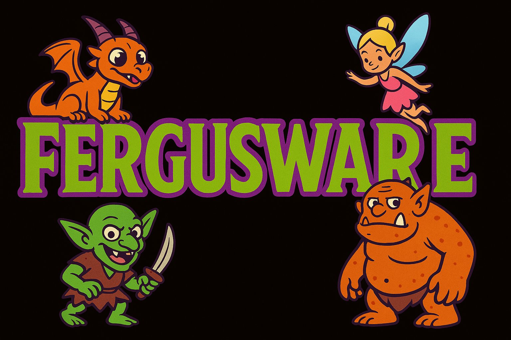

# Lorexicon Support

_A public space for feature requests and support questions for Lorexicon._

**📚 Explore the full documentation → [Lorexicon Docs](https://support.fergusware.com/lorexicon-support/)**

## Project Overview

Lorexicon is an AI-powered companion module for Foundry VTT. Currently it is designed specifically for Pathfinder 2e Remaster. With Lorexicon, you can:

- Create immersive scene descriptions, creature compositions, and artwork directly in the Journal
- Generate fully formed, immediately usable Pathfinder 2e Remaster Actors on the fly
- Conjure either unique NPCs or generic creatures
- Produce NPC and creature portraits without leaving Foundry

Lorexicon integrates seamlessly into your GM toolkit so you spend less time on menus and more time telling your story.

**Fergusware covers all AI service costs** for Lorexicon through [Patreon](https://www.patreon.com/c/fergusware/about) memberships. You will not incur any additional AI fees when using this module. _An AI API key is NOT required to use Lorexicon._

> **Note:** Lorexicon is run as a hosted service on Amazon Web Services. The Lorexicon codebase is proprietary and hosted in a private repository. This public repo is dedicated solely to support, feedback, and community discussion.

See our current [Feature List](https://support.fergusware.com/lorexicon-support/Features) and upcoming [Development Roadmap](https://support.fergusware.com/lorexicon-support/Roadmap)!

You can find us on [Discord](https://discord.gg/Xb6FHpPdpF)!

More questions? Please read our [FAQ](https://support.fergusware.com/lorexicon-support/FAQ) or visit the full **[Lorexicon Docs site](https://support.fergusware.com/lorexicon-support/)** for tutorials, examples, and deep dives.

## Purpose of This Repository

This repository exists to centralize everything related to:

- **Feature Requests**  
  Have an idea for an enhancement or a new AI-driven tool within Lorexicon? Let us know!

- **Support Questions**  
  General usage questions, troubleshooting help, or configuration guidance -- ask them through Issues and we'll respond.

- **Bug Reports**  
  If you encounter unexpected behavior, crashes, or errors when using Lorexicon, file a new issue describing the problem.

By keeping support and feature tracking transparent, everyone in the Lorexicon community can see what’s in progress, upvote requests, and follow along with fixes and enhancements.

## How to File an Issue

1. Click the “Issues” tab at the top of this repo.
2. Choose **New issue**.
3. Give your issue a clear title.
4. In the description, be as detailed as possible:
   - **For bugs**: Include your Foundry version, Lorexicon version, steps to reproduce, and any error messages or screenshots.
   - **For feature requests**: Describe what you’d like to see, why it would be helpful, and any example use cases.
   - **For support questions**: Explain what you’re trying to do, what you’ve tried so far, and where you’re stuck.
5. Click **Submit new issue**.

# Dependencies

This module requires a licensed copy of Foundry Virtual Tabletop to run.

# Trademarks and Copyright

Pathfinder® is a registered trademark of Paizo Inc. All rights reserved. See [Paizo Licenses](https://paizo.com/licenses) for full license terms.  
Foundry Virtual Tabletop © 2025 Foundry Gaming, LLC. All rights reserved. Refer to [Foundry Virtual Tabletop End User License Agreement](https://foundryvtt.com/article/license/) for full license terms.
