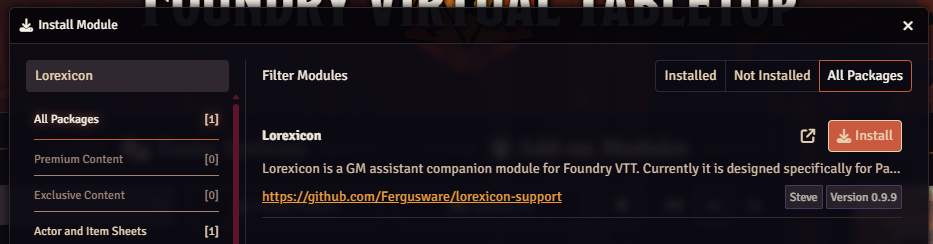

# **🪄 The Lorexicon Grimoire of Creation**

_Your PF2e Foundry VTT Arcane Companion_

---

### Chapter I: Runes of Compatibility

Before you invoke the Lorexicon’s power, ensure your realm meets these glyphs:

- **Foundry VTT**: v12.343 or later
- **Pathfinder 2e Remaster**: v6.12 or later
- **Dependencies**: None — Lorexicon stands alone

---

### Chapter II: Invoking the Module

1. In Foundry’s **Add-on Modules → Install Module**, seek out [Lorexicon](https://foundryvtt.com/packages/lorexicon) and click Install:

   

   Should you require, you may paste the manifest directly from the Oracle:

   ```
   https://raw.githubusercontent.com/Fergusware/lorexicon-support/refs/heads/main/manifests/module.json
   ```

2. Click **Install**, then in **Manage Modules** enable **Lorexicon**.
3. Restart your Foundry realm if the fates demand it.

---

### Chapter III: Opening the Lorexicon Portal

To call Lorexicon forth:

1. Venture to either the **Actors** tab or **Journal** tab of your Foundry interface.
2. Click the **Lorexicon** button nestled at the bottom.
3. On first start, you will be prompted to **Bind Your Patreon Pact** (see below).
4. Behold the enchanted prompt window, alive with your monthly usage runes.

---

### Chapter IV: Binding Your Patreon Pact

When you first awaken Lorexicon’s arcane circuits, you must forge a Patreon pact:

1. Upon enabling, a new popup window beckons—ensure your browser allows pop-ups for Foundry.
2. If you are not yet logged into Patreon, you’ll be prompted for credentials.
3. In that window, grant access:
   - **Lorexicon** would like to view your Patreon identity, pledges, and account status
   - This ritual weaves your Patreon allegiance into the very fabric of your Foundry realm.
4. Success seals the pact — Lorexicon’s welcome grimoire unfurls in Foundry.
5. Failure or denial scrawls an error in chat.
6. At any time, you may unbind the ritual by clicking the 🔗 Unlink icon in the Usage panel.

---

### Chapter V: The Welcome Invocation

When first summoned, Lorexicon will unfurl its greeting as a herald in the Chat tab, welcoming you to the forge of creation.

---

### Chapter VI: Crafting Your Creation

| **Arcane Element** | **Description**                                                                                                          |
| ------------------ | ------------------------------------------------------------------------------------------------------------------------ |
| **Type**           | Lore Codex: **NPC**, **Creature**, **Hazard**, **Encounter**, or **Merchant**                                            |
| **Prompt**         | Vast textarea (up to 50,000 characters) for your narrative or mechanical visions                                         |
| **Result**         | When the summoning is complete, displays your creation’s name, linked to its freshly born document                       |
| **Usage Panel**    | • **Completed:** x / y<br>• **Remaining:** z (flames red at 0)<br>• **Patreon ID:** 12345 🔗<br>• **Subscription:** free |
| **Buttons**        | • **Submit**: commence creation<br>• **Cancel**: banish or close the portal<br>• **Reset**: clear all runes              |

Below the runes, a **Progress Bar** pulses while the forge works its magic (~30-60 seconds).

---

### Chapter VII: The Summoning of Your Creation

When the progress bar runs its course:

- Lorexicon conjures your creation into the world -- safely nestled within a "Lorexicon" folder on the **Actor** or **Journal** tab.
- The creation opens automatically.
- The **Result** rune bears the name of the creation as a link -- your new creation awaits.

_No further import rituals are required to begin using your creation._

---

### Chapter VIII: Tracking Your Magical Quota

Each month’s magic is finite. Observe your Usage Panel:

- **Completed:** Prompts expended this month
- **Remaining:** Spells left (resets at the turn of the calendar)
- **Patreon ID:** Your bonded Patreon identity (click 🔗 to sever the bond)
- **Subscription:** Your current tier

Hover any rune for further illumination.

---

### Chapter IX: When the Fates Frown

Should darkness cloud your ritual:

| **Affliction**                   | **Lorexicon’s Response**                                                       |
| -------------------------------- | ------------------------------------------------------------------------------ |
| **Auth Denied/Failure**          | Chat scrolls an "authentication error" -- reopen the popup and retry.          |
| **Quota Depleted**               | A red "Remaining" rune blazes 0; a toast and chat warning cry "No more magic." |
| **Generation Timeout/API Error** | Chat: "Generation failed — please try again."                                 |
| **Popup Blocked/Closed/Timeout** | Chat: "Patreon authentication failed. Allow pop-ups and retry."                |

---

### Chapter X: Sage Advice & Troubleshooting

- **Lorexicon button vanished?** Ensure the module is enabled and your realm restarted.
- **Pop-up barred?** Permit pop-ups for your Foundry domain.
- **Remaining stuck at 0?** Quotas renew at the start of each calendar month.
- **Auth errors persist?** Click 🔗 to unlink, then reforge your Patreon pact.

---

### Appendix: Of Deeper Runes and Hidden Scripts

For those who would wield Lorexicon's magic in more intricate ways--binding theme, tone, structure, or lore across multiple summonings--look beyond these pages to the scroll titled:

🧠 [Contexts: Anchoring Your Arcane Intent](Contexts)

This companion tome reveals how to store and reuse prompt fragments, customize behaviors, and guide the generative spirits with precision.

_May its guidance sharpen your craft._

---

_Go forth, brimming with confidence. May every NPC you summon serve your tale, and may your creatures be legends in their own right._
