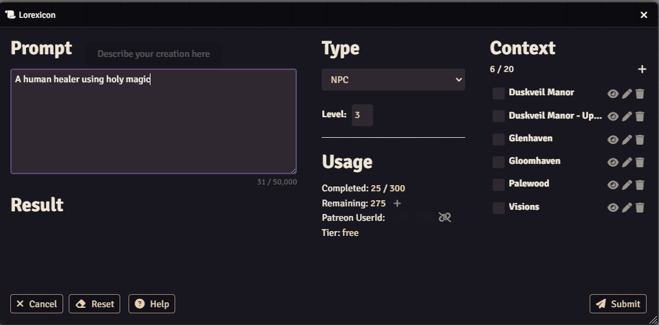
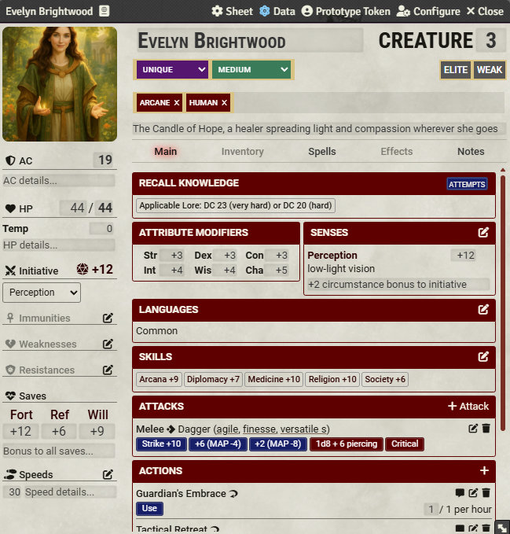
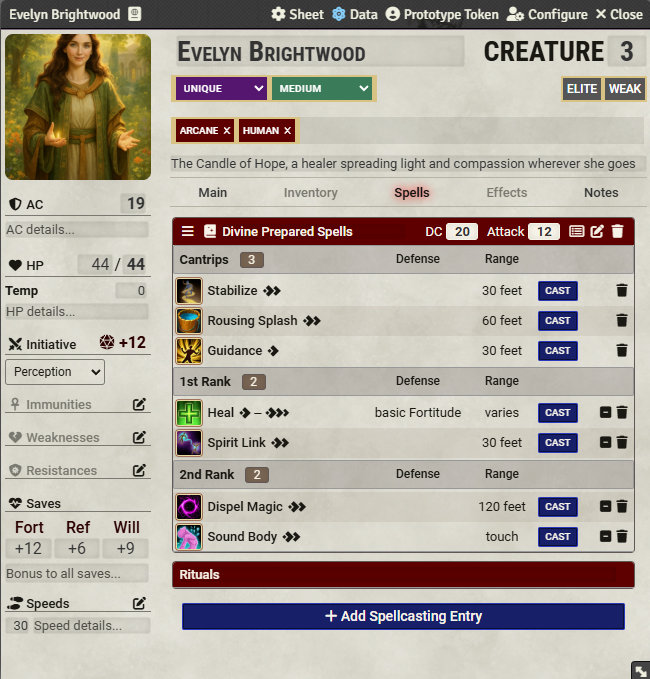
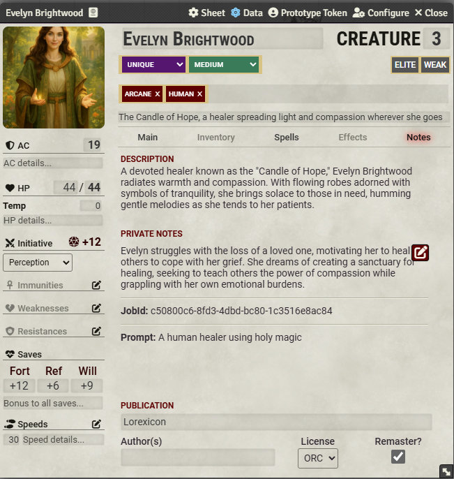
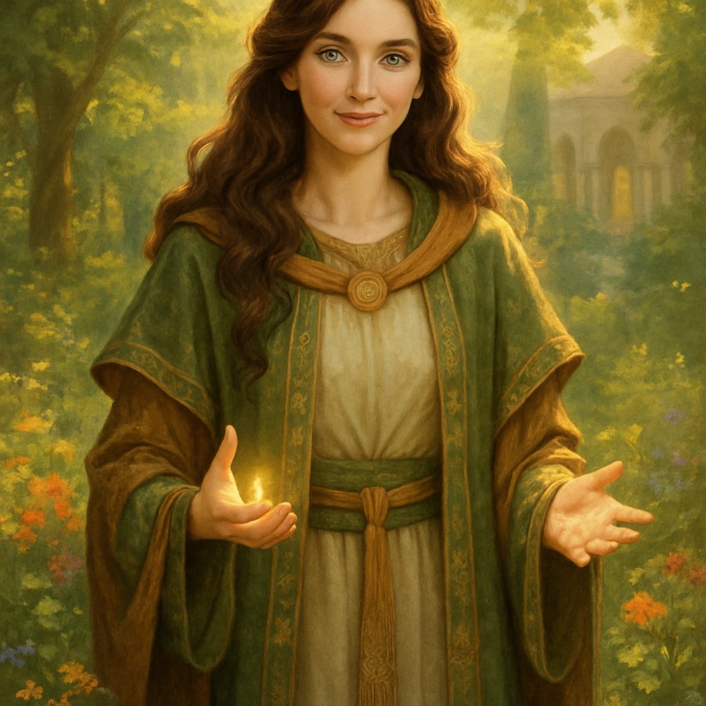

# Evelyn Brightwood - NPC

> A human healer using holy magic.

A bare whisper of a prompt — just seven words — and Lorexicon conjures a complete Level 3 divine spellcaster. Flip through the slides to see the full stat block with linked rolls, a Spells tab populated with level-appropriate divine prepared spells (cantrips through 2nd rank, complete with attack bonus and DC), a Notes tab bearing both a public description and private GM notes, and a generated portrait.

  

    

      
    

    

      
    

    

      
    

    

      
    

    

      
    

  

  <!-- Navigation buttons -->
  

  

  <!-- Pagination dots -->
  

