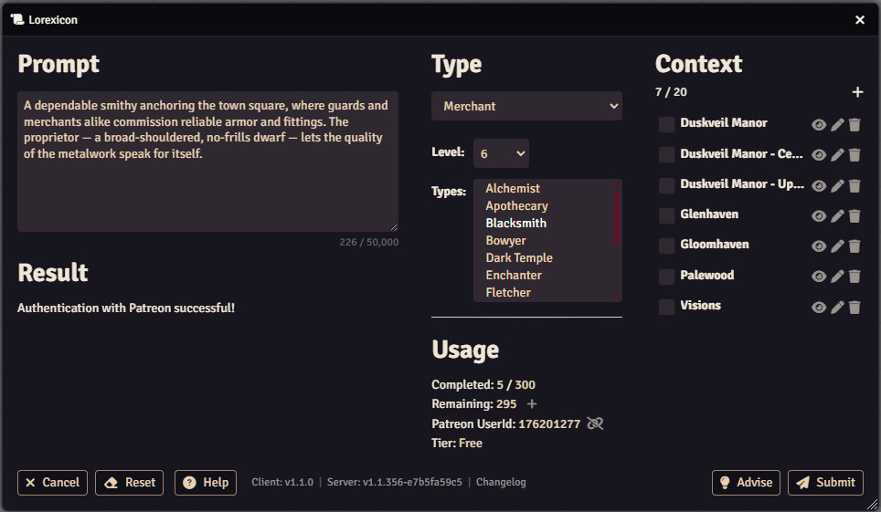
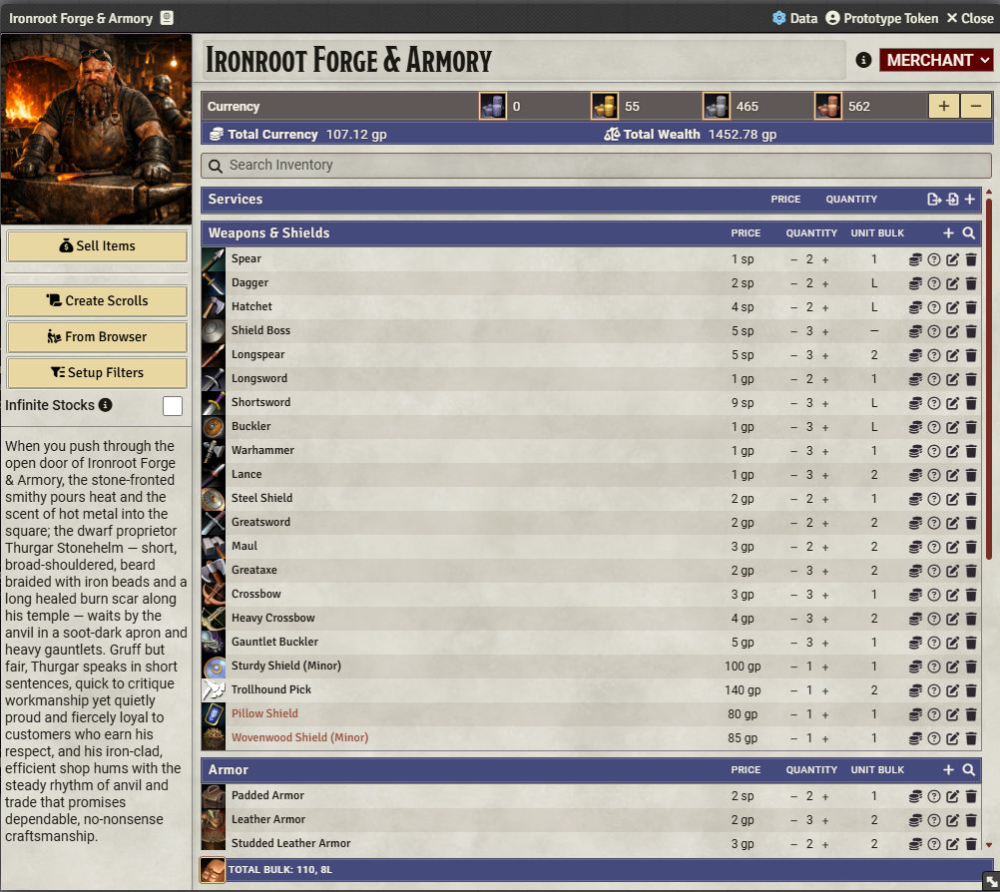
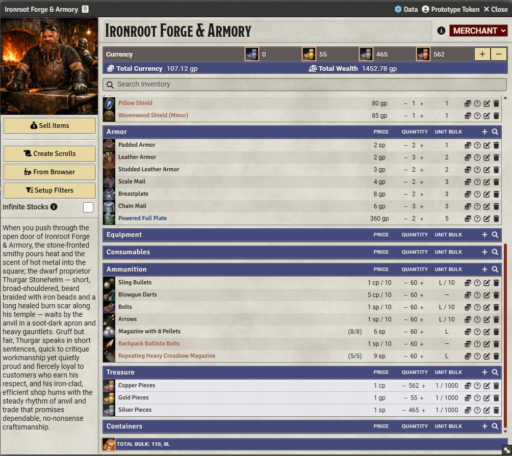
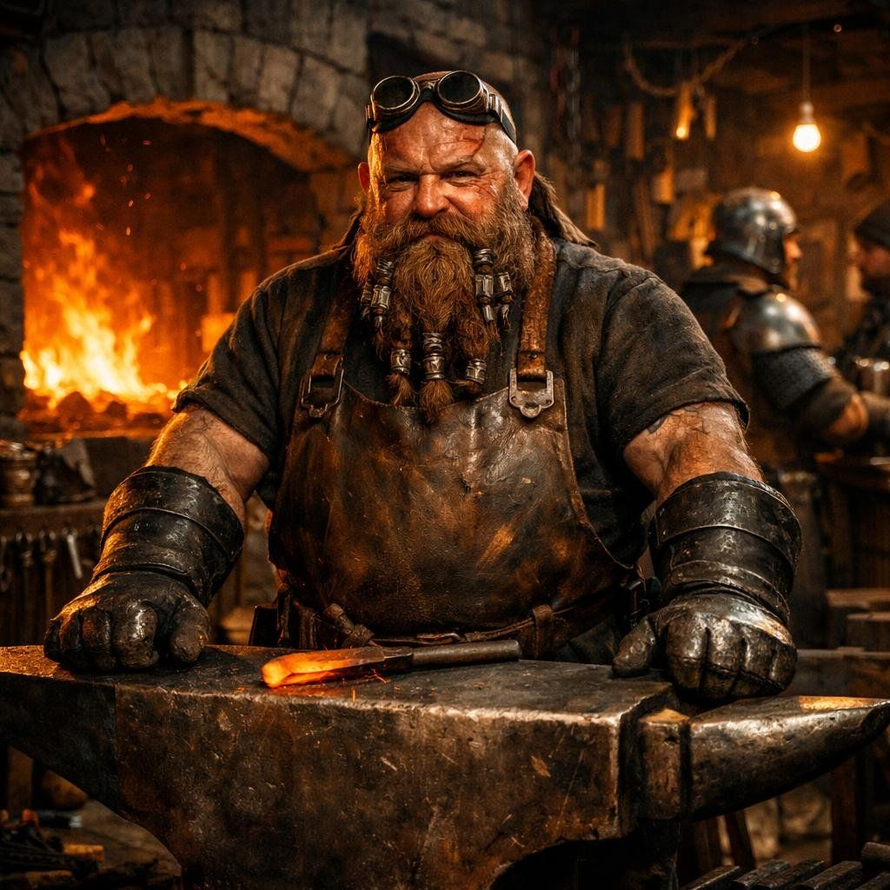

# Ironroot Forge & Armory - Merchant

> A dependable smithy anchoring the town square, where guards and merchants alike commission reliable armor and fittings. The proprietor — a broad-shouldered, no-frills dwarf — lets the quality of the metalwork speak for itself.

A sturdy prompt forges a sturdy shop. From two sentences Lorexicon hammers out a complete Level 6 Blacksmith merchant — the first Merchant in our gallery. Browse the slides to see a full inventory organized across Weapons & Shields, Armor, Ammunition, and more, stocked with wares ranging from humble spears and daggers up to a Powered Full Plate (360 gp) and a Trollhound Pick (140 gp). The sidebar carries both a vivid shop description and a backstory for the proprietor, Thurgar Stonehelm — gruff, iron-beaded, and quietly proud of his craft. A generated portrait rounds out the forge, placing Thurgar right where he belongs: behind his anvil.

  

    

      
    

    

      
    

    

      
    

    

      
    

  

  <!-- Navigation buttons -->
  

  

  <!-- Pagination dots -->
  

