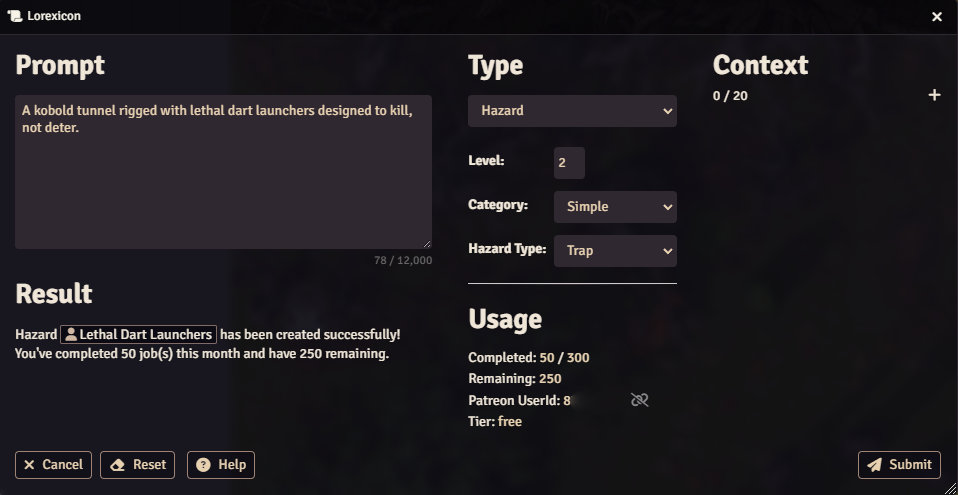
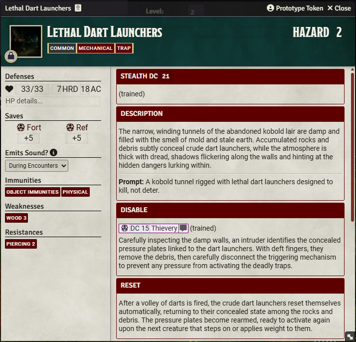
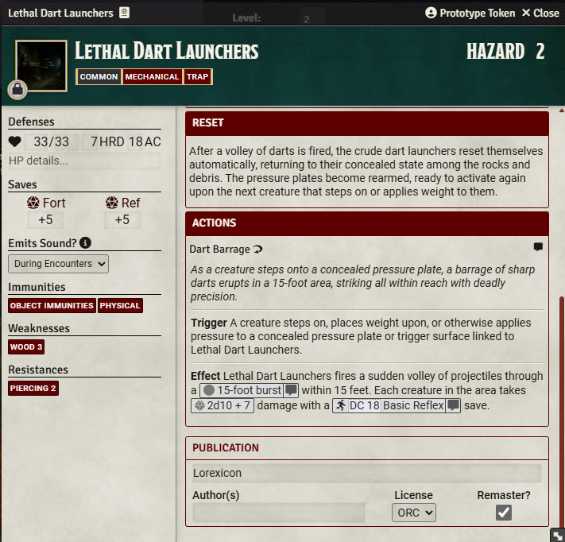

# Lethal Dart Launchers - Hazard

> A kobold tunnel rigged with lethal dart launchers designed to kill, not deter.

A look at what a generated hazard delivers. The Hazard sheet shows the full stat block — Stealth DC, HP, hardness, immunities, weaknesses, and saves — alongside a thematic description, disable conditions with inline skill checks, and reset behavior. Scroll to the reaction to see the automated Dart Barrage action complete with trigger, area burst template, damage roll, and a linked Reflex save — all clickable and ready for play. _(Foundry VTT interface shown — Lorexicon Web delivers the same creation through a standalone web application.)_

  

    

      
    

    

      
    

    

      
    

    

      
    

  

  <!-- Navigation buttons -->
  

  

  <!-- Pagination dots -->
  

