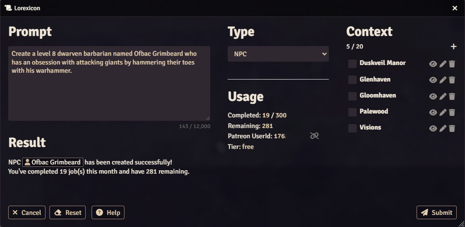
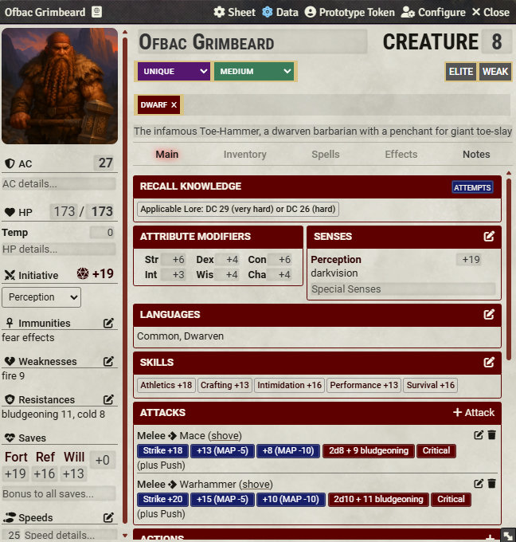
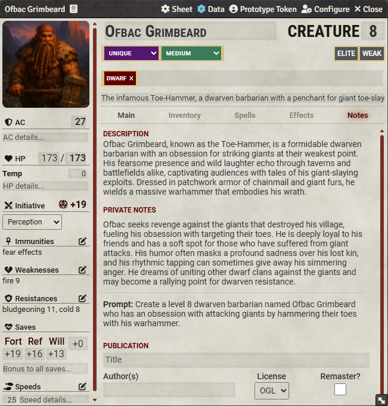
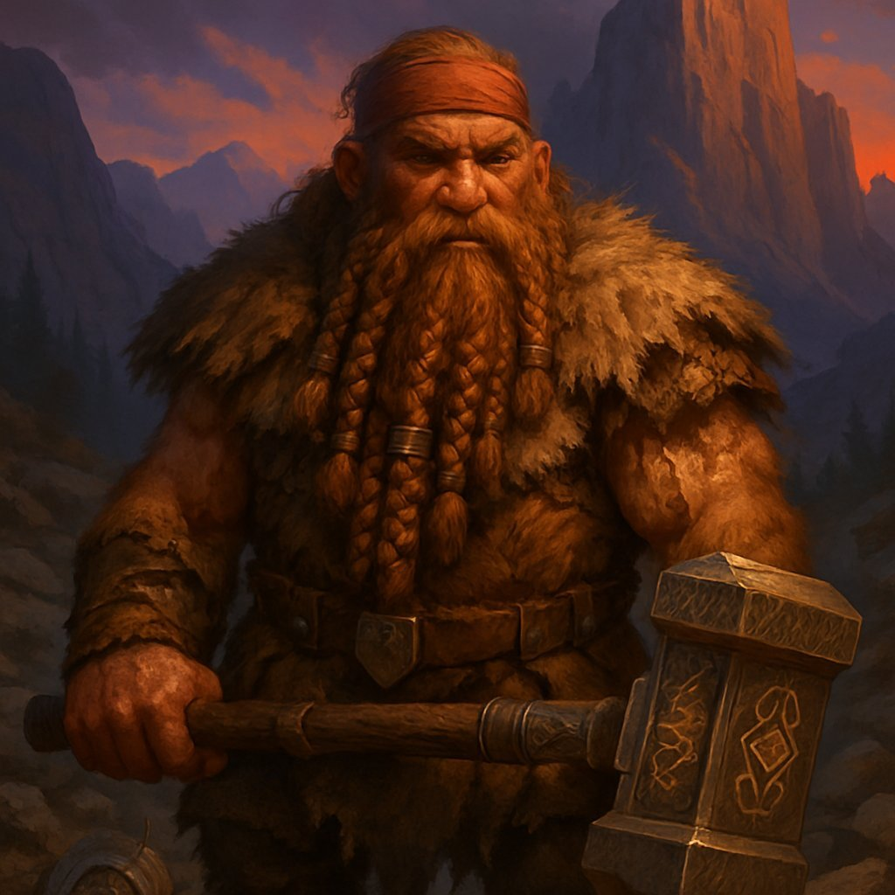

# Ofbac Grimbeard - NPC

> Create a level 8 dwarven barbarian named Ofbac Grimbeard who has an obsession with attacking giants by hammering their toes with his warhammer.

A detailed, character-driven prompt — and Lorexicon honors every rune. Note how the actor sheet reflects the toe-hammering obsession in its tagline, abilities, and weapon entries (both mace and warhammer with full strike and damage rolls). The Notes tab weaves the giant-slaying fixation into a backstory and private GM hooks, giving you narrative fuel well beyond what the prompt asked for.

  

    

      
    

    

      
    

    

      
    

    

      
    

  

  <!-- Navigation buttons -->
  

  

  <!-- Pagination dots -->
  

