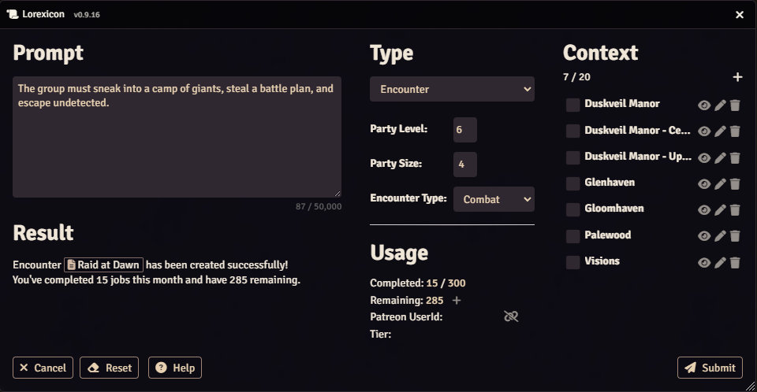
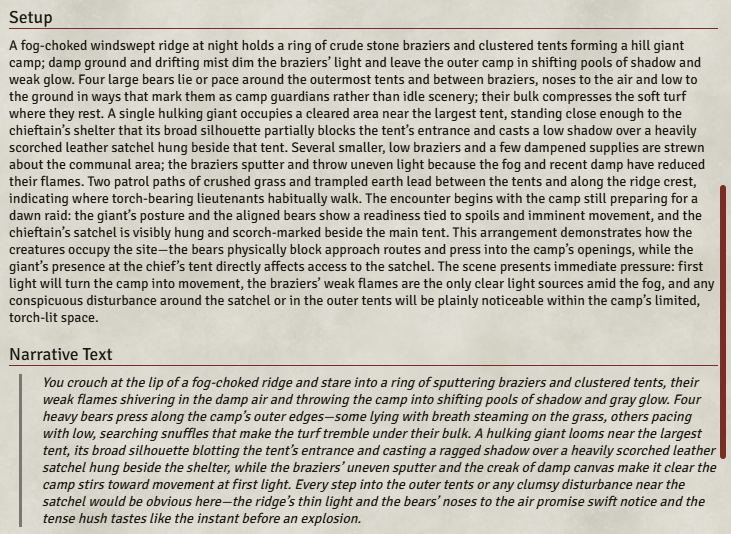
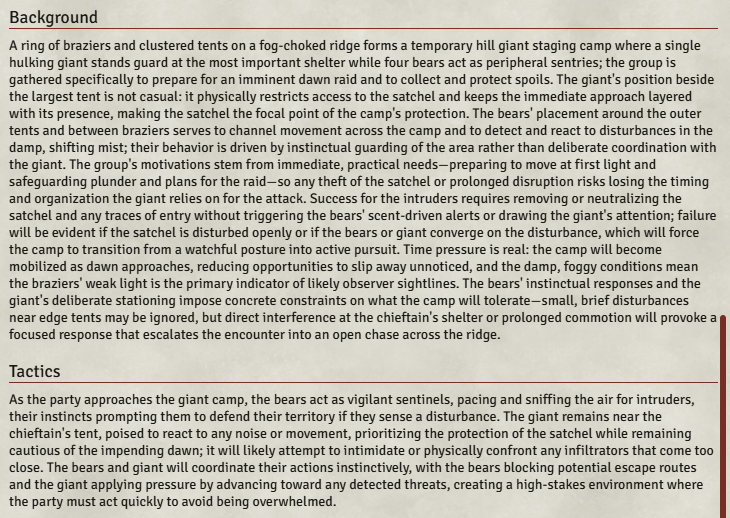
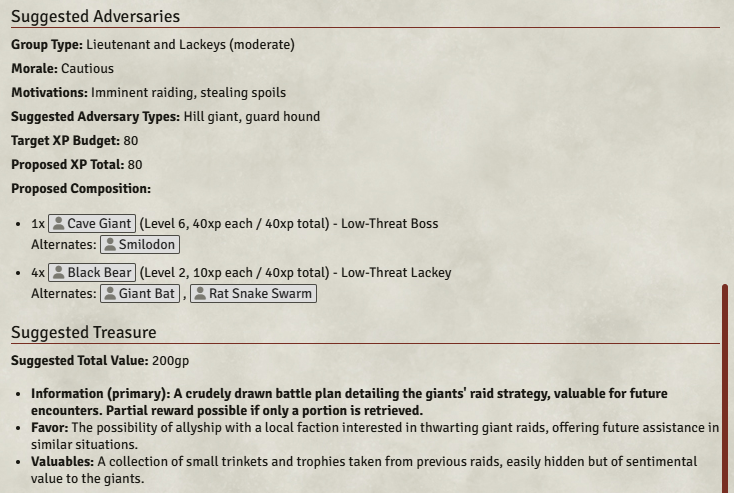

# Raid at Dawn - Encounter

> The group must sneak into a camp of giants, steal a battle plan, and escape undetected.

  

    

      
    

    

      
    

    

      
    

    

      
    

    

      
    

    

      
    

  

  <!-- Navigation buttons -->
  

  

  <!-- Pagination dots -->
  

