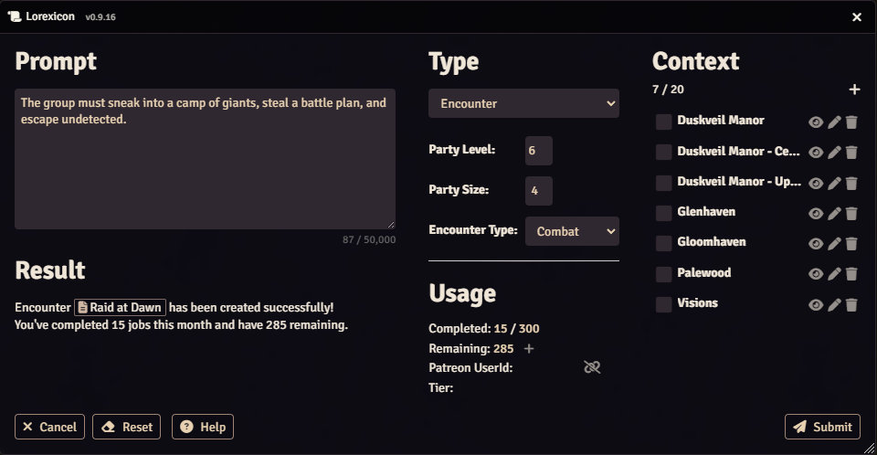
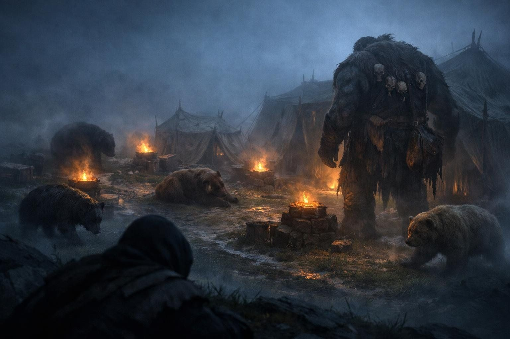
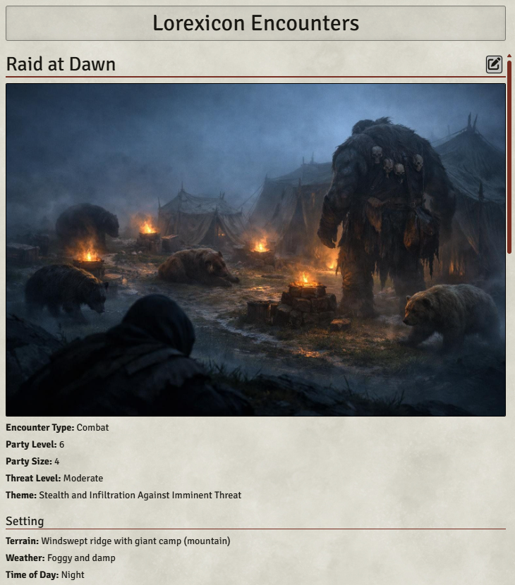
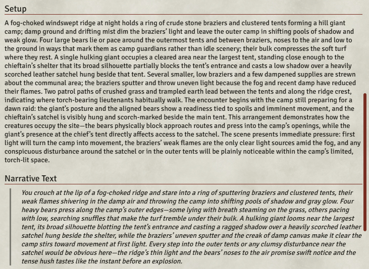
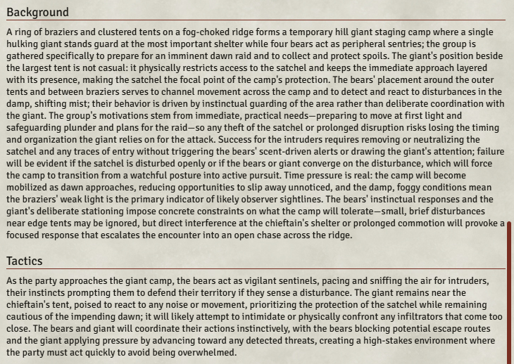
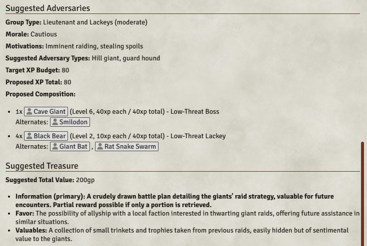

# Raid at Dawn - Encounter

> The group must sneak into a camp of giants, steal a battle plan, and escape undetected.

An encounter journal entry, start to finish. The slides walk through the generated scene image, the encounter setting (type, party level, threat level, terrain, and time of day), the tactical setup and narrative background, and the creature recommendations — primary and alternate selections drawn from the SRD, complete with suggested quantities and scaling notes for your party size.

  

    

      
    

    

      
    

    

      
    

    

      
    

    

      
    

    

      
    

  

  <!-- Navigation buttons -->
  

  

  <!-- Pagination dots -->
  

