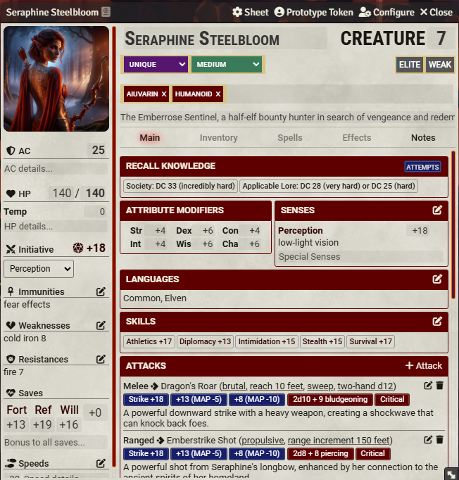
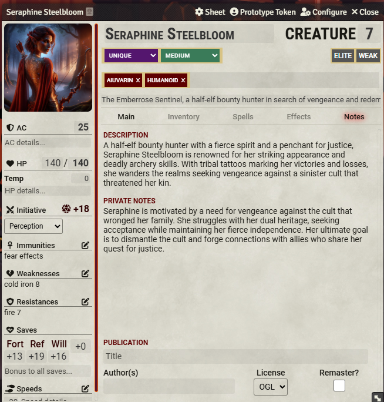

# Seraphine Steelbloom - NPC

> Create a warrior

  

    

      
    

    

      
    

    

      
    

    

      
    

    

      
    

    

      
    

  

  <!-- Navigation buttons -->
  

  

  <!-- Pagination dots -->
  

