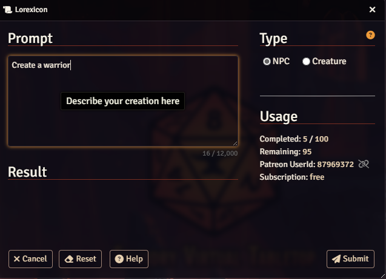
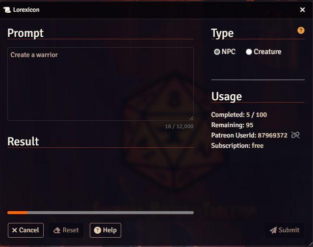
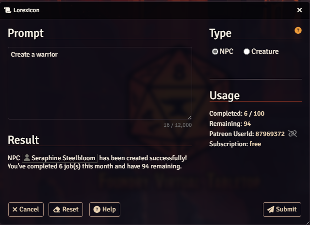
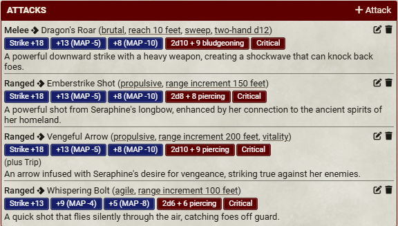
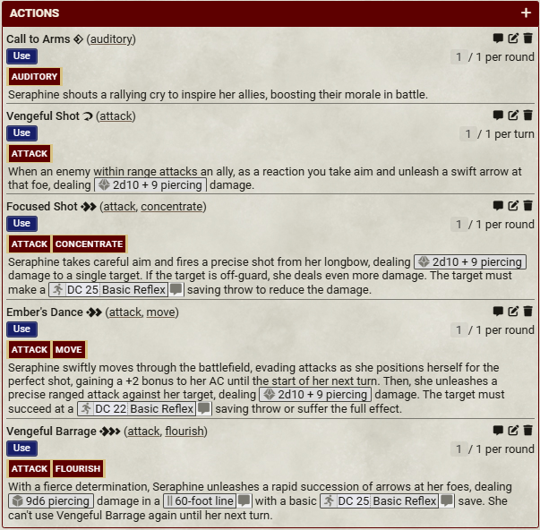
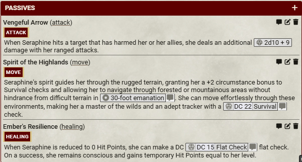
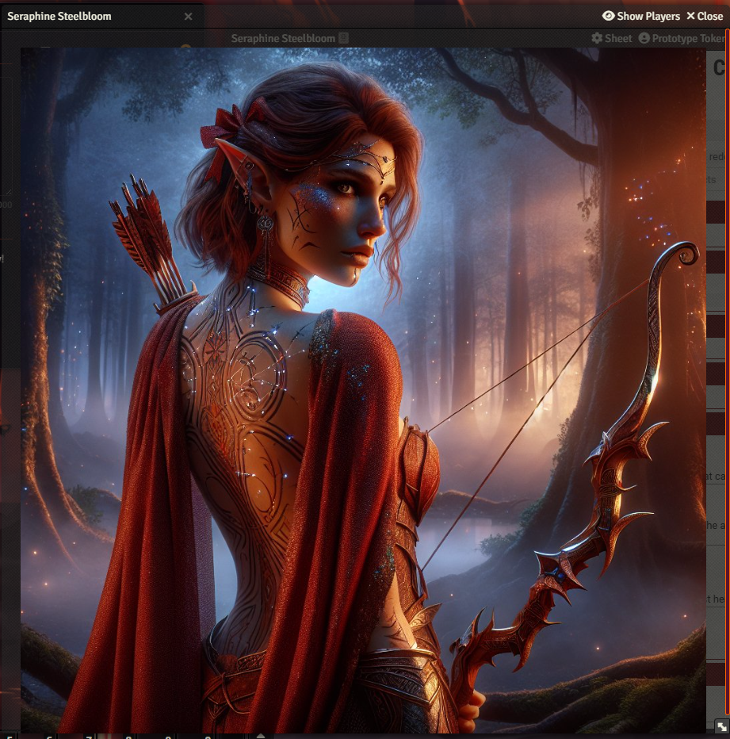
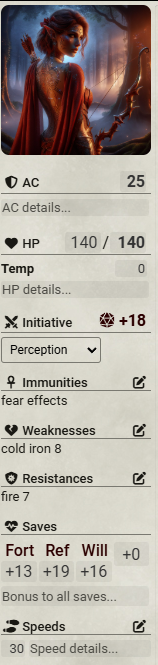
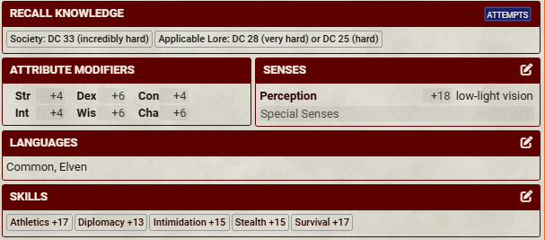

  

    

      
    

    

      
    

    

      
    

    

      
    

    

      
    

    

      
    

    

      
    

    

      
    

    

      
    

    

      
    

    

      
    

    <!-- add more .swiper-slide blocks as needed -->
  

  <!-- Navigation buttons -->
  

  

  <!-- Pagination dots -->
  

