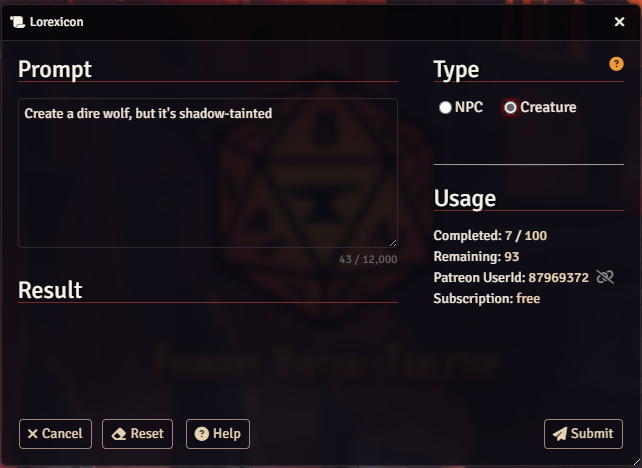
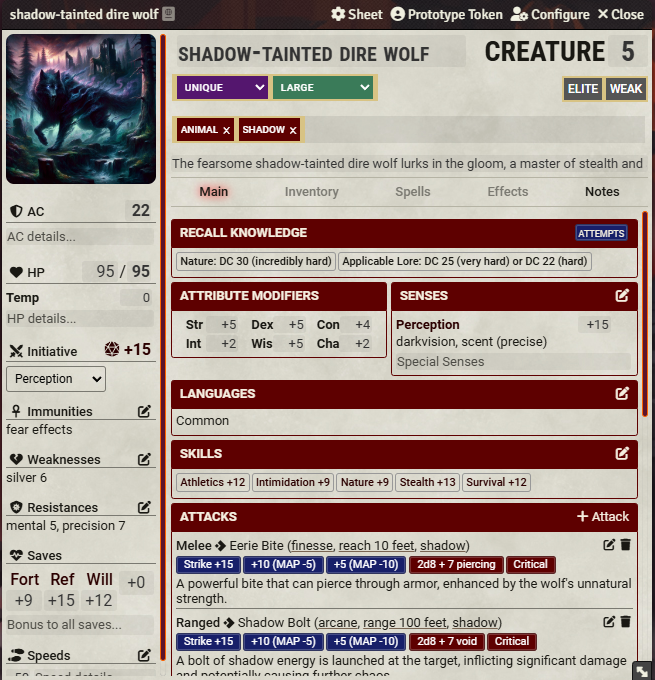
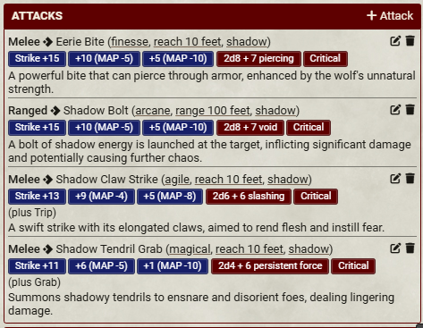
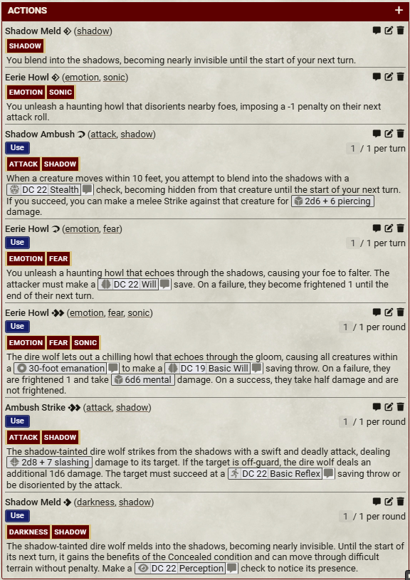
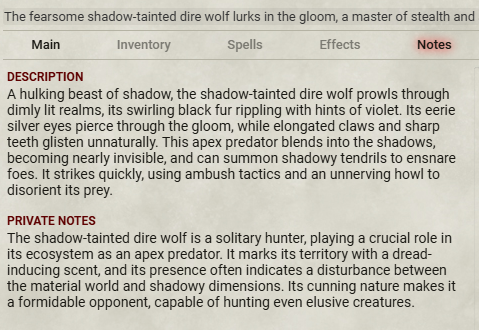
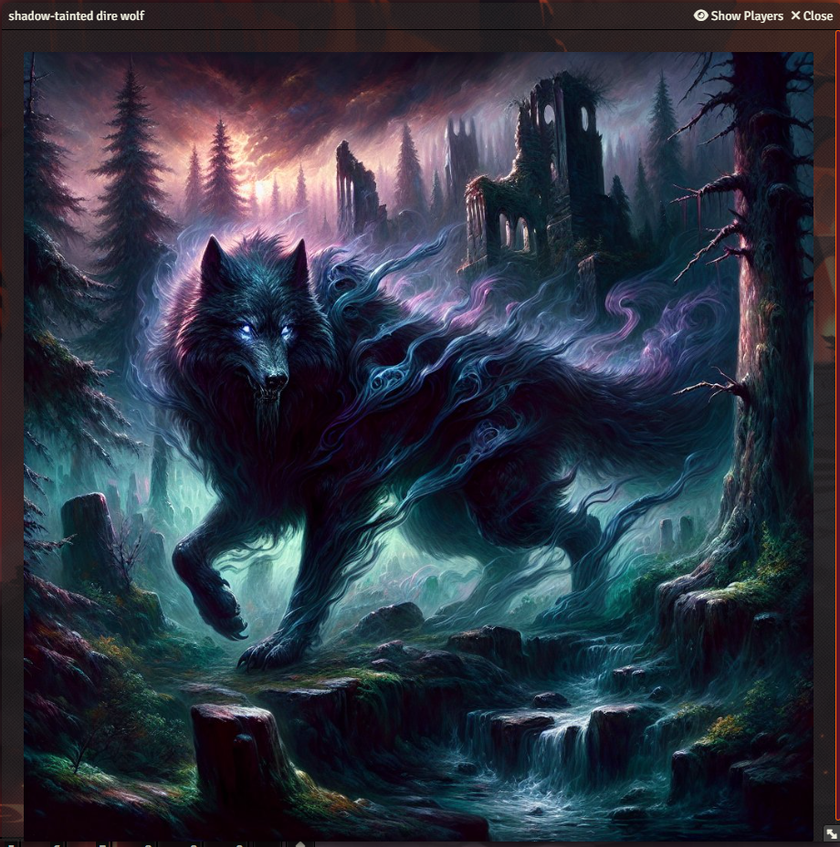

# Shadow Dire Wolf - Creature

> Create a dire wolf, but it's shadow-tainted

  

    

      
    

    

      
    

    

      
    

    

      
    

    

      
    

    

      
    

  

  <!-- Navigation buttons -->
  

  

  <!-- Pagination dots -->
  

