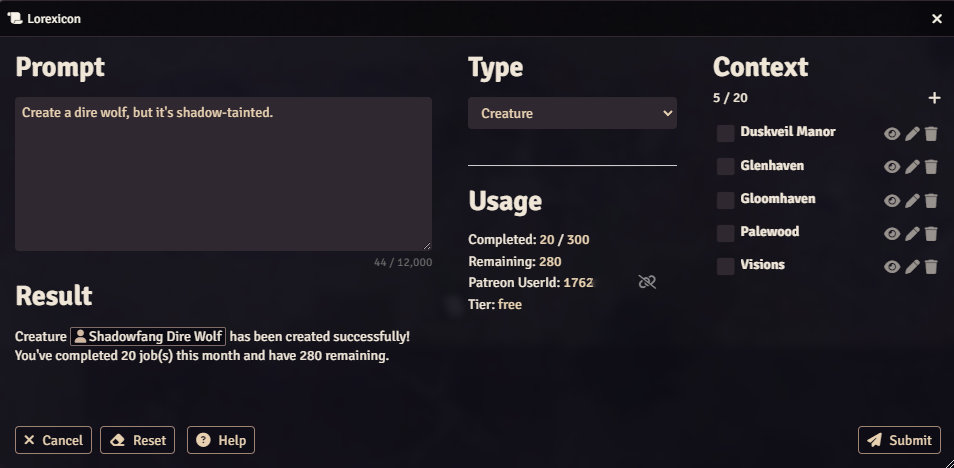
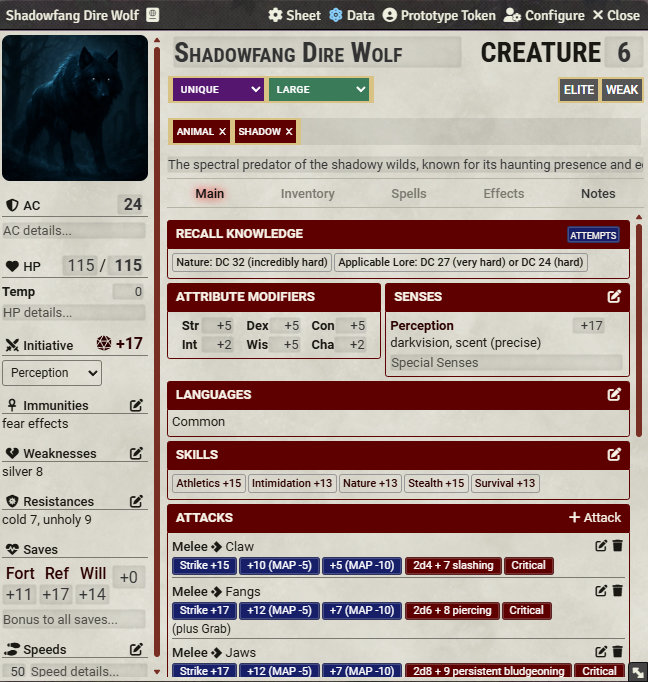
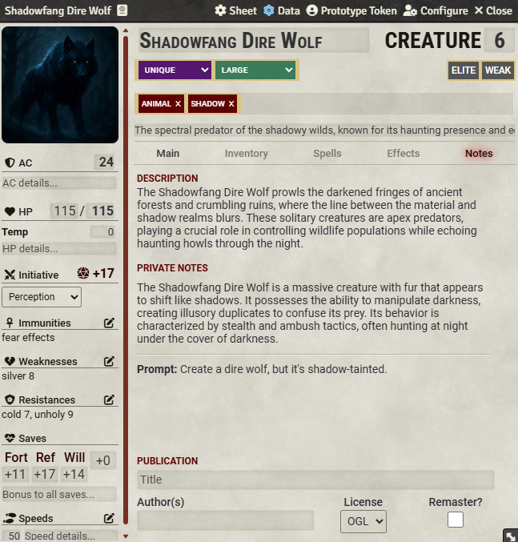
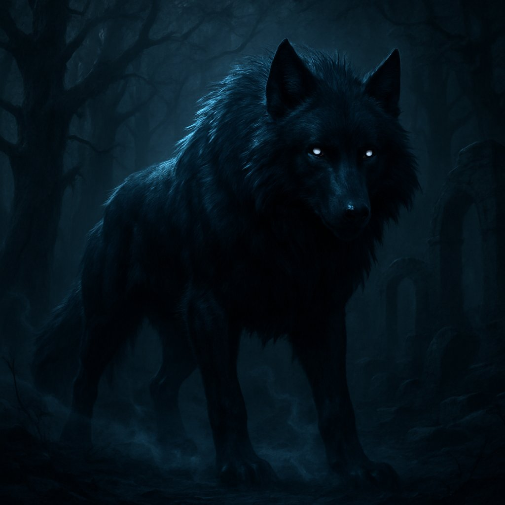

# Shadow Dire Wolf - Creature

> Create a dire wolf, but it's shadow-tainted.

A short, thematic twist on a familiar creature — and the forge runs with it. The result is a Level 6 "Shadowfang Dire Wolf" bearing the Shadow trait, with cold and unholy resistances, a silver weakness, darkvision, and multiple attack types including claw, fangs, and jaws. The Notes tab describes its shadow-realm hunting behavior, while the portrait captures its spectral menace. _(Foundry VTT interface shown — Lorexicon Web delivers the same creation through a standalone web application.)_

  

    

      
    

    

      
    

    

      
    

    

      
    

  

  <!-- Navigation buttons -->
  

  

  <!-- Pagination dots -->
  

